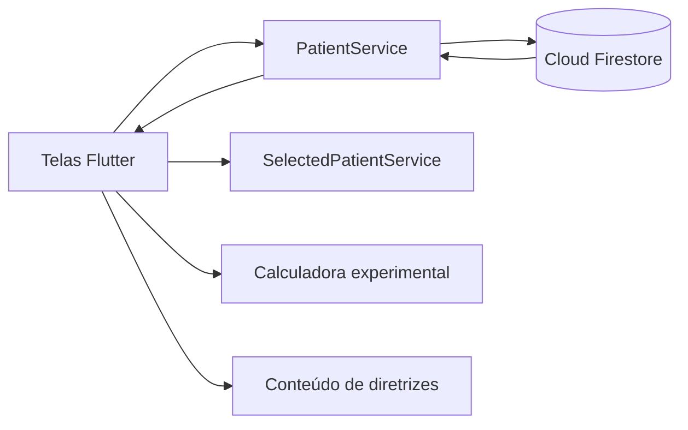

# InsuGuia Clinical Prototype

Protótipo acadêmico de uma ferramenta digital para apoiar o acompanhamento da glicemia e o estudo da insulinoterapia em pacientes hospitalizados não críticos.

O projeto surgiu a partir de uma demanda apresentada por um professor da área de Medicina no contexto de sua pesquisa de doutorado. Como atividade semestral da disciplina de Desenvolvimento de Plataformas Móveis, diferentes grupos da turma desenvolveram propostas de solução, com possibilidade de uma delas ser selecionada para continuidade acadêmica.

Esta versão registra a proposta desenvolvida pelo grupo e não representa um produto médico final ou clinicamente validado.

> **Aviso importante:** o InsuGuia é um protótipo educacional e de pesquisa. As sugestões calculadas pelo aplicativo não devem ser utilizadas para diagnóstico, prescrição ou tomada de decisão clínica. A conduta assistencial é responsabilidade exclusiva de profissionais habilitados e deve seguir protocolos institucionais validados.

## Objetivo

Explorar como uma aplicação multiplataforma pode organizar informações de pacientes, registrar glicemias e apresentar uma calculadora experimental de dose de correção, acompanhada de conteúdo educacional baseado no tema de manejo da hiperglicemia hospitalar.

## Funcionalidades

- Cadastro e exclusão de pacientes
- Listagem atualizada em tempo real pelo Cloud Firestore
- Seleção do paciente em acompanhamento
- Visualização de idade, peso, diagnóstico e esquema de insulina
- Registro da glicemia mais recente
- Calculadora experimental de dose de correção
- Recomendações textuais conforme a faixa glicêmica informada
- Consulta de conteúdo resumido sobre insulinoterapia
- Navegação entre pacientes, calculadora, detalhes e diretrizes
- Layout adaptável para dispositivos móveis e telas maiores

## Tecnologias


### Aplicação principal

- Flutter e Dart
- Material Design
- Firebase Core
- Cloud Firestore
- Firebase Authentication
- Firebase Storage
- Firebase Analytics
- `fl_chart`

### Protótipo de interface

- React 19
- TypeScript
- Vite
- Componentes Radix UI
- Lucide React
- Recharts

## Estrutura

O repositório preserva duas etapas do desenvolvimento:

```text
insuguia-clinical-prototype/
|-- flutter_layout_app/
|   |-- lib/
|   |   |-- models/             # Modelo de paciente
|   |   |-- screens/            # Pacientes, calculadora e diretrizes
|   |   |-- services/           # Firestore e paciente selecionado
|   |   |-- widgets/            # Componentes reutilizáveis
|   |   |-- firebase_options.dart
|   |   `-- main.dart
|   |-- android/
|   |-- ios/
|   |-- web/
|   |-- windows/
|   |-- linux/
|   `-- macos/
|-- components/                 # Componentes do protótipo React
|-- styles/                     # Estilos do protótipo
|-- App.tsx                     # Protótipo originado no Figma
`-- README.md
```

O protótipo React serviu para explorar a experiência e a organização das telas. A implementação funcional principal está em `flutter_layout_app`.

## Arquitetura Flutter



### Modelo de paciente

O aplicativo trabalha com informações como:

- Nome e idade
- Peso
- Diagnóstico
- Esquema de insulina
- Faixa glicêmica alvo
- Última glicemia registrada
- Data da última atualização

### Persistência

O `PatientService` utiliza a coleção `patients` no Cloud Firestore para:

- Criar pacientes
- Observar alterações em tempo real
- Excluir registros
- Atualizar a última glicemia

## Calculadora experimental

A tela de cálculo utiliza a glicemia informada e a faixa-alvo do paciente para produzir uma estimativa de correção e uma mensagem conforme a faixa detectada.

Essa lógica foi construída para avaliação acadêmica da interface e do fluxo da aplicação. Os parâmetros presentes no código são simplificados, não foram validados como dispositivo médico e precisam de revisão por especialistas antes de qualquer estudo clínico ou uso assistencial.

## Referência temática

O tema do protótipo está relacionado ao capítulo **Manejo da hiperglicemia hospitalar em pacientes não-críticos**, da Diretriz da Sociedade Brasileira de Diabetes, edição 2025:

- [Diretriz SBD 2025](https://diretriz.diabetes.org.br/)
- [Hiperglicemia hospitalar em pacientes não-críticos](https://diretriz.diabetes.org.br/manejo-da-hiperglicemia-hospitalar-em-pacientes-nao-criticos/)

A presença dessas referências descreve o contexto estudado e não significa que a implementação tenha sido homologada ou endossada pela Sociedade Brasileira de Diabetes.

## Como executar

### Pré-requisitos

- Flutter compatível com Dart 3.9 ou superior
- Android Studio, Xcode ou navegador configurado para Flutter
- Projeto Firebase próprio

### Configuração

1. Entre na aplicação Flutter:

```bash
cd flutter_layout_app
```

2. Instale as dependências:

```bash
flutter pub get
```

3. Configure um projeto Firebase para os ambientes desejados:

```bash
flutterfire configure
```

4. Habilite o Cloud Firestore no console do Firebase.

5. Execute a aplicação:

```bash
flutter run
```

Os arquivos Firebase versionados pertencem ao ambiente acadêmico original. Para reutilizar ou publicar o projeto, configure credenciais próprias e regras adequadas de segurança.

## Verificações

```bash
cd flutter_layout_app
flutter analyze
flutter test
```

Para testar o build web:

```bash
flutter build web
```

## Limitações atuais

- Protótipo sem validação clínica ou regulatória
- Fórmulas e parâmetros simplificados no código
- Metas glicêmicas ainda não são configuradas no cadastro atual
- Ausência de autenticação integrada ao fluxo principal
- Regras de segurança do Firestore dependem do ambiente configurado
- Não há trilha de auditoria clínica
- Não há testes específicos para os cálculos
- Parte dos textos do código legado apresenta problemas de codificação
- O protótipo React é um export de interface e não possui, no repositório atual, os arquivos de entrada e configuração necessários para execução isolada com Vite

## Possíveis evoluções

- Validação das regras por equipe médica e comitê de ética
- Parametrização completa por paciente e protocolo institucional
- Autenticação e perfis de acesso
- Histórico de glicemias e doses
- Alertas e rastreabilidade das alterações
- Testes automatizados para regras de cálculo
- Revisão de acessibilidade e usabilidade com profissionais da saúde
- Avaliação de requisitos regulatórios e de proteção de dados

## Contexto acadêmico

Projeto semestral desenvolvido em grupo para a disciplina de Desenvolvimento de Plataformas Móveis, a partir de uma proposta ligada à pesquisa de doutorado de um professor da área de Medicina.

O trabalho teve caráter de prototipação e experimentação acadêmica. Uma das soluções desenvolvidas pela turma poderia ser escolhida para continuidade em etapas posteriores da pesquisa.

## Equipe

- [Sofya Andrade](https://github.com/sofyaandrade)
- [Matheus Ferrari dos Santos](https://github.com/matheusferrarimf)
- [João Ferretti](https://github.com/Joaoferretti)

Os créditos foram preservados conforme o histórico de contribuições do repositório.
